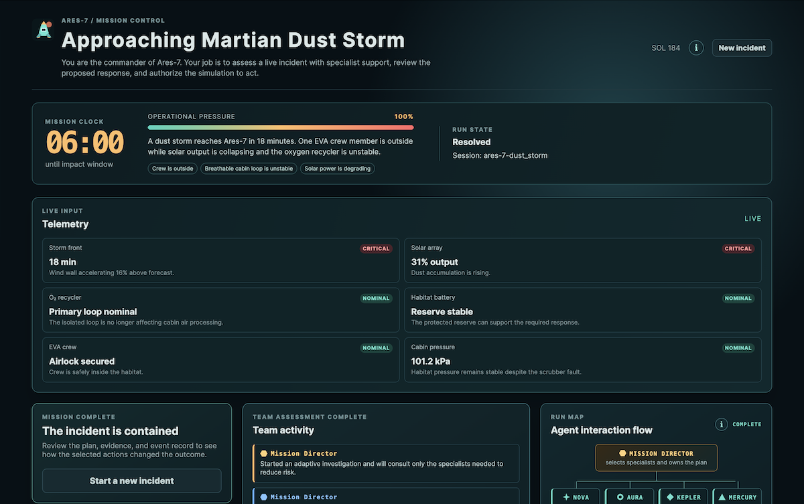
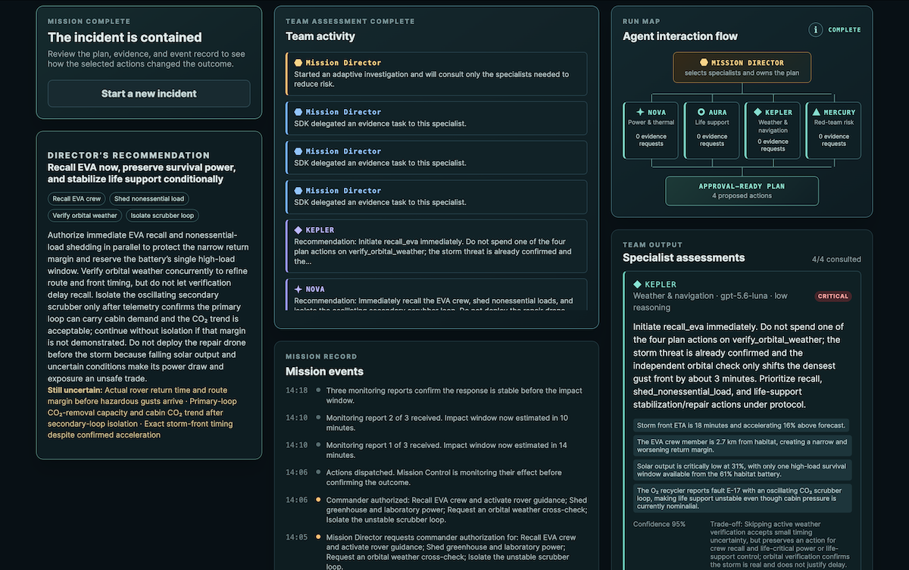
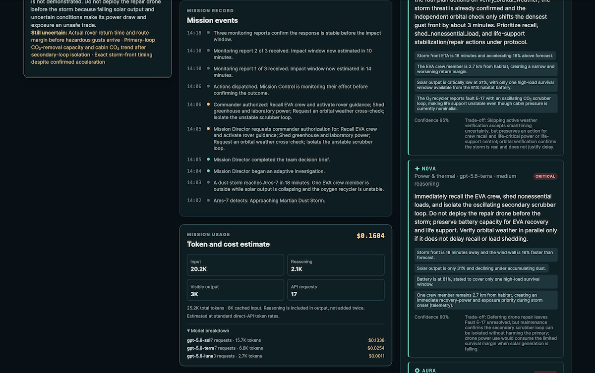
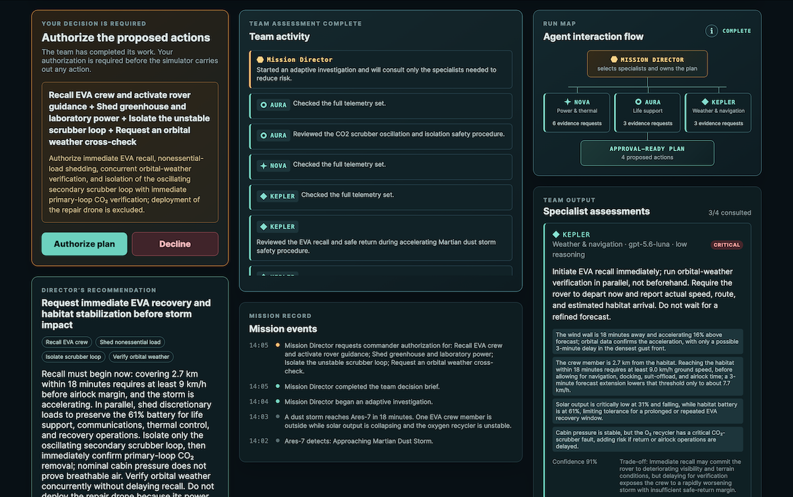
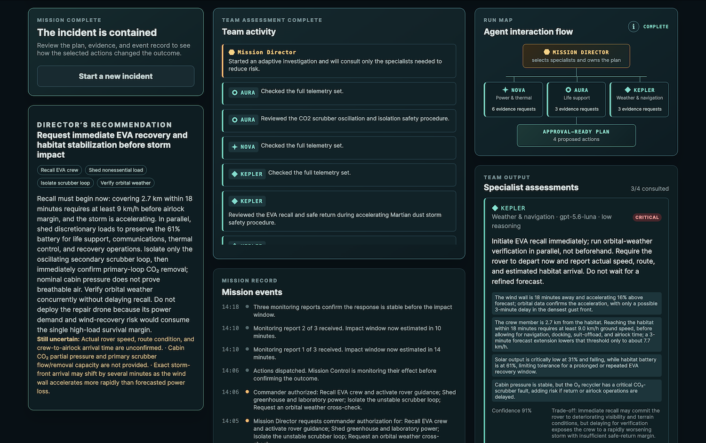
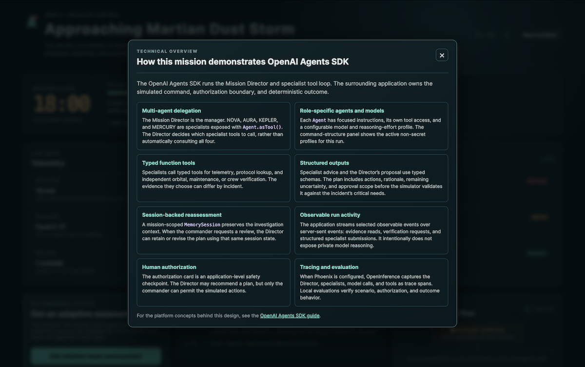
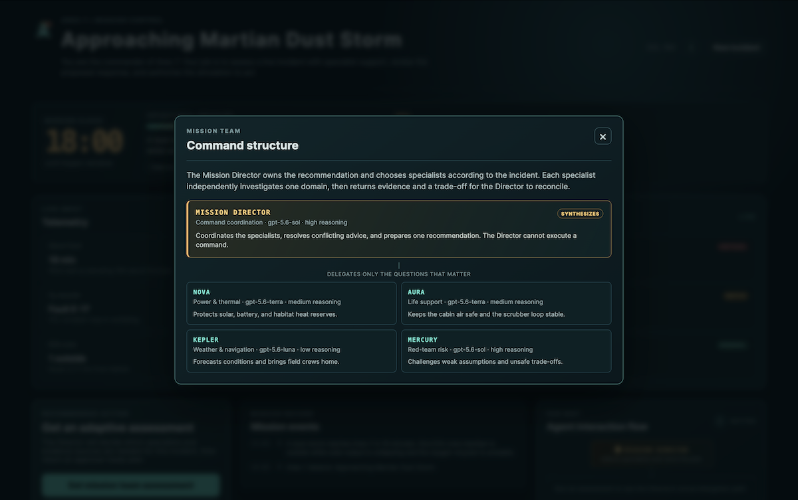
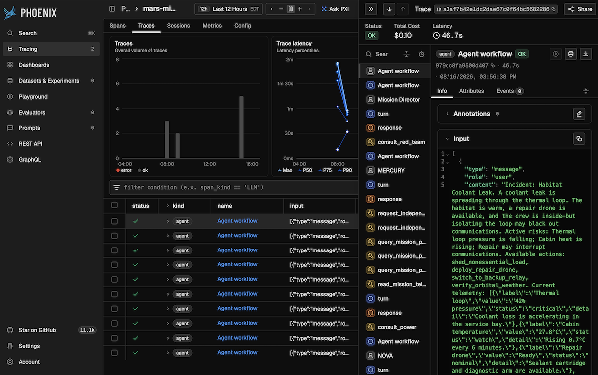
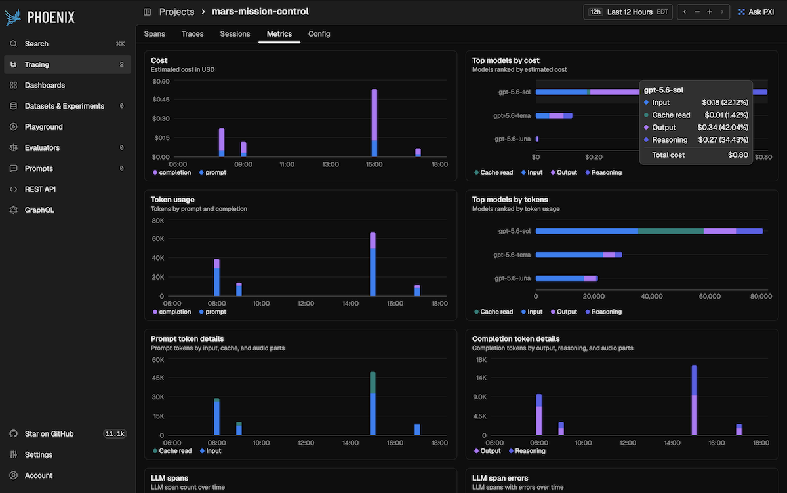

# OpenAI Agents Demo: Mars Mission Control

An interactive multi-agent mission simulator built with the
[OpenAI Agents SDK](https://openai.github.io/openai-agents-js/).
You are the commander of a Mars habitat responding to one of five randomized
incidents, including dust storms, a coolant leak, a solar flare, and a stranded
rover recovery, each with incomplete evidence and different trade-offs.

Read the accompanying blog post, [Multi-Agent Orchestration, MCP, and Human Approval: Mars Mission Control with the OpenAI Agents SDK](https://garystafford.medium.com/3d9acee15b72?sharedUserId=garystafford), for detailed information on the project.


## Technology

- [TypeScript](https://www.typescriptlang.org/), [React](https://react.dev/), and [Vite](https://vite.dev/) for the interactive client
- [Express](https://expressjs.com/) for the local mission API and server-sent event stream
- [OpenAI Agents SDK](https://openai.github.io/openai-agents-js/) for specialist orchestration, sessions, structured outputs, guardrails, streaming, and native approval interruptions
- [Model Context Protocol](https://modelcontextprotocol.io/) for the local Mission Control MCP server that supplies telemetry, protocols, and verification
- [Arize Phoenix](https://arize.com/docs/phoenix/) and [OpenInference](https://arize-ai.github.io/openinference/) for optional agent tracing

## What it demonstrates

- A Mission Director choosing relevant specialists through Agent.asTool(), rather than mechanically calling all four
- A local stdio Mission Control MCP server for telemetry, protocol retrieval, and independent verification
- A structured decision plan with actions, rationale, uncertainty, and approval scope
- An SDK MemorySession that scopes the team investigation
- SDK run-item streaming into the Team Record, without exposing private model reasoning
- Mission-level token usage and an estimated direct-API cost, including input, cached input, reasoning, and visible output tokens
- Tool input and final-output guardrails that reject plans missing scenario-critical actions
- A native `needsApproval` interruption that pauses `submit_mission_plan`; the commander resumes or rejects the same SDK `RunState`
- A deterministic simulator where the selected plan produces a stabilized or degraded outcome
- Focused evaluation cases for scenarios, authorization, and outcome behavior

## Screenshots

**1. Mission Control**







**2. HITL interaction**



**3. Team activity**



**4. OpenAI Agents SDK features**



**5. Mission team**



**6. Phoenix tracing**



**7. Phoenix metrics**



## Prerequisites

- A current [Node.js](https://nodejs.org/en/download) LTS release with npm
- An [OpenAI API key](https://platform.openai.com/api-keys), only if you want to run a model-backed mission assessment
- [Docker](https://www.docker.com/) or [Finch](https://runfinch.com/), only if you want to enable optional Phoenix tracing

The local simulator and mission console can run without an OpenAI API key. Copy
`.env.example` to `.env.local` and add your key before selecting **Get mission
team assessment**.

## Run it

> **⚠️ Before you proceed:** Selecting **Get mission team assessment** sends
> requests to the configured model provider and may incur API charges on your
> account. Review your provider's current pricing, billing settings, and usage
> limits before running an assessment. The local simulator and mission console
> can be explored without making model requests.

Run `npm install`, then `npm run dev`.

Open <http://localhost:5173>. The server reads `OPENAI_API_KEY` from `.env.local`;
it is only used when you select Get mission team assessment. The rest of the
simulator runs locally and deterministically.

Copy `.env.example` to `.env.local` if you are setting up a new machine. It
also defines a model and reasoning-effort profile for each mission role. The
server reads those values at startup; restart it after changing them. The
Command Structure panel displays the active, non-secret profiles.

## Mission token and cost accounting

After an assessment, the **Mission usage** card shows cumulative usage for the
Mission Director and only the specialists the Director selected. It updates
again if the commander asks for a reassessment or resumes the approval step.

The card reports:

- API request count and total tokens for the mission
- Input and cached-input tokens
- Output tokens, with reasoning and visible output shown separately
- An estimated USD cost, plus a per-model breakdown

Reasoning tokens are reported separately for visibility but are already part of
output tokens, so the calculator does not charge them twice. The estimate is:

```text
((input tokens - cached input tokens) × input rate
 + cached input tokens × cached-input rate
 + output tokens × output rate) / 1,000,000
```

The application includes standard direct-API rates for its default demo models.
See the [OpenAI pricing page](https://developers.openai.com/api/docs/pricing)
for current rates.

Set `MISSION_COST_PRICING_OVERRIDES` to a JSON object when you use a different
model, service tier, region, or provider. Values are USD per million tokens:

```text
MISSION_COST_PRICING_OVERRIDES={"my-model":{"input":1,"cachedInput":0.1,"output":4}}
```

Usage still appears for an unpriced model, but the total cost is withheld until
that model has an override. The UI labels cost as an estimate because
account-specific pricing, regional uplifts, and non-token tool charges are
outside the local calculation.

## Phoenix tracing

Phoenix tracing is optional and does not affect the mission interface. Start a
Phoenix collector with Docker:

```bash
docker run -d --name phoenix -p 6006:6006 arizephoenix/phoenix:latest
```

Open Phoenix at <http://localhost:6006>, then add these values to `.env.local`:

```text
PHOENIX_ENABLED=true
PHOENIX_PROJECT_NAME=mars-mission-control
PHOENIX_COLLECTOR_ENDPOINT=http://localhost:6006
```

The app exports OpenInference spans for the Director, specialists, model calls,
and local tool calls. It keeps the OpenAI Agents SDK's native exporter enabled
as well. Tracing starts only when `PHOENIX_ENABLED=true`.

Useful local commands:

```bash
docker logs -f phoenix     # Follow collector logs
docker stop phoenix        # Stop the collector
docker start phoenix       # Start it again later
docker rm phoenix          # Remove the stopped container
```

## Demo sequence

1. Select **Get mission team assessment**.
2. Watch **Team activity** as the Director chooses specialists and evidence sources for this incident.
3. Read the structured recommendation, including its remaining uncertainties.
4. Select **Review proposed command**, then submit the SDK-paused plan for authorization.
5. Authorize or decline the paused `submit_mission_plan` tool call, then advance the mission clock after authorization.
6. Review the team record and whether the selected plan stabilized the incident.

## Validate

Run the complete local verification suite:

```bash
npm run lint          # ESLint for TypeScript and React code-quality checks
npm run format:check  # Verify Prettier formatting without modifying files
npm run check         # TypeScript checks for client and server
npm run eval          # Deterministic mission-simulator evaluations
npm run build         # Production client and server build
```

Use `npm run format` to apply the project formatting style locally.

## Next capabilities

The scaffolding deliberately keeps external systems simulated. A natural next
increment is a SandboxAgent counterfactual analyst that writes scenario artifacts
in an isolated workspace, followed by a handoff-based specialist conversation for
commander follow-up questions.

---

_The contents of this repository represent my viewpoints and not those of my past or current employers, including Amazon Web Services (AWS). All third-party libraries, modules, plugins, and SDKs are the property of their respective owners._
