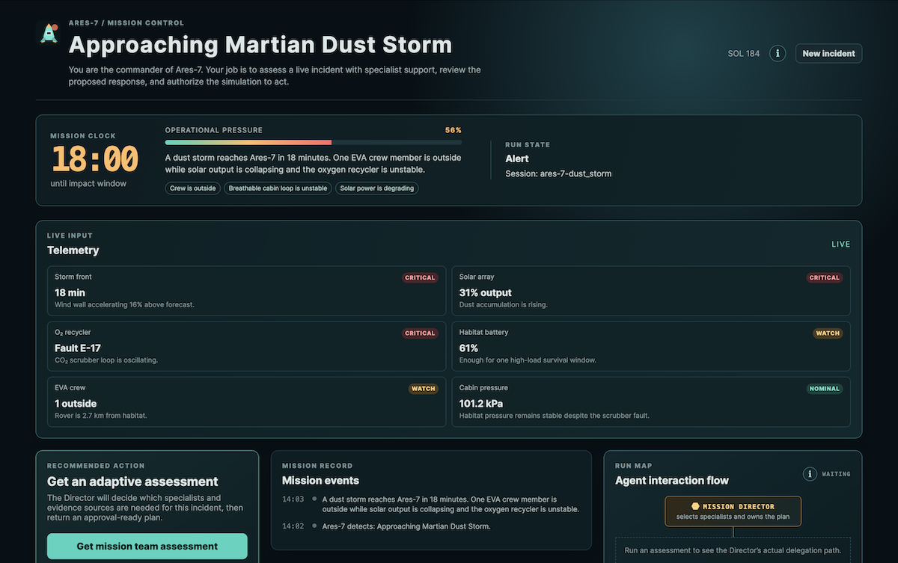

# Mars Mission Control

An interactive multi-agent mission simulator built with the
[OpenAI Agents SDK](https://openai.github.io/openai-agents-js/).
You are the commander of a Mars habitat responding to one of five randomized
incidents, including dust storms, a coolant leak, a solar flare, and a stranded
rover recovery, each with incomplete evidence and different trade-offs.

## Screenshots

**1. Mission Control**



**2. HITL interaction**


**3. Team activity**


**4. OpenAI Agents SDK features**


**5. Mission team**


**6. Phoenix tracing**


**7. Phoenix metrics**


## Technology

- [TypeScript](https://www.typescriptlang.org/), [React](https://react.dev/), and [Vite](https://vite.dev/) for the interactive client
- [Express](https://expressjs.com/) for the local mission API and server-sent event stream
- [OpenAI Agents SDK](https://openai.github.io/openai-agents-js/) for specialist orchestration, tools, sessions, and structured outputs
- [Arize Phoenix](https://arize.com/docs/phoenix/) and [OpenInference](https://arize-ai.github.io/openinference/) for optional agent tracing

## What it demonstrates

- A Mission Director choosing relevant specialists through Agent.asTool(), rather than mechanically calling all four
- Typed function tools for telemetry, protocol retrieval, and independent verification
- A structured decision plan with actions, rationale, uncertainty, and approval scope
- An SDK MemorySession that scopes the team investigation
- A streamed Team Record that exposes the Director's coordination, evidence retrieval, and specialist submissions as they happen
- A visible human approval gate before the simulated command is applied
- A deterministic simulator where the selected plan produces a stabilized or degraded outcome
- Focused evaluation cases for scenarios, authorization, and outcome behavior

## Run it

Run npm install, then npm run dev.

Open http://localhost:5173. The server reads OPENAI_API_KEY from .env.local;
it is only used when you select Get mission team assessment. The rest of the
simulator runs locally and deterministically.

Copy `.env.example` to `.env.local` if you are setting up a new machine. It
also defines a model and reasoning-effort profile for each mission role. The
server reads those values at startup; restart it after changing them. The
Command Structure panel displays the active, non-secret profiles.

## Phoenix tracing

Phoenix tracing is optional and does not affect the mission interface. Start a
Phoenix collector with Docker:

```bash
docker run -d --name phoenix -p 6006:6006 arizephoenix/phoenix:latest
```

Open Phoenix at http://localhost:6006, then add these values to `.env.local`:

```text
PHOENIX_ENABLED=true
PHOENIX_PROJECT_NAME=mars-mission-control
PHOENIX_COLLECTOR_ENDPOINT=http://localhost:6006
```

The app exports OpenInference spans for the Director, specialists, model calls,
and local tool calls. It keeps the OpenAI Agents SDK's native exporter enabled
as well. Tracing starts only when `PHOENIX_ENABLED=true`.

Useful local commands:

```bash
docker logs -f phoenix     # Follow collector logs
docker stop phoenix        # Stop the collector
docker start phoenix       # Start it again later
docker rm phoenix          # Remove the stopped container
```

## Demo sequence

1. Select **Get mission team assessment**.
2. Watch **Team activity** as the Director chooses specialists and evidence sources for this incident.
3. Read the structured recommendation, including its remaining uncertainties.
4. Select **Review proposed command**, authorize it, then advance the mission clock.
5. Review the team record and whether the selected plan stabilized the incident.

## Validate

Run the complete local verification suite:

```bash
npm run lint          # ESLint for TypeScript and React code-quality checks
npm run format:check  # Verify Prettier formatting without modifying files
npm run check         # TypeScript checks for client and server
npm run eval          # Deterministic mission-simulator evaluations
npm run build         # Production client and server build
```

Use `npm run format` to apply the project formatting style locally.

## Next capabilities

The scaffolding deliberately keeps external systems simulated. The natural next
increment is a Mission Control MCP server for telemetry and inventory, followed
by a SandboxAgent counterfactual analyst that writes scenario artifacts in an
isolated workspace.

---

_The contents of this repository represent my viewpoints and not those of my past or current employers, including Amazon Web Services (AWS). All third-party libraries, modules, plugins, and SDKs are the property of their respective owners._
